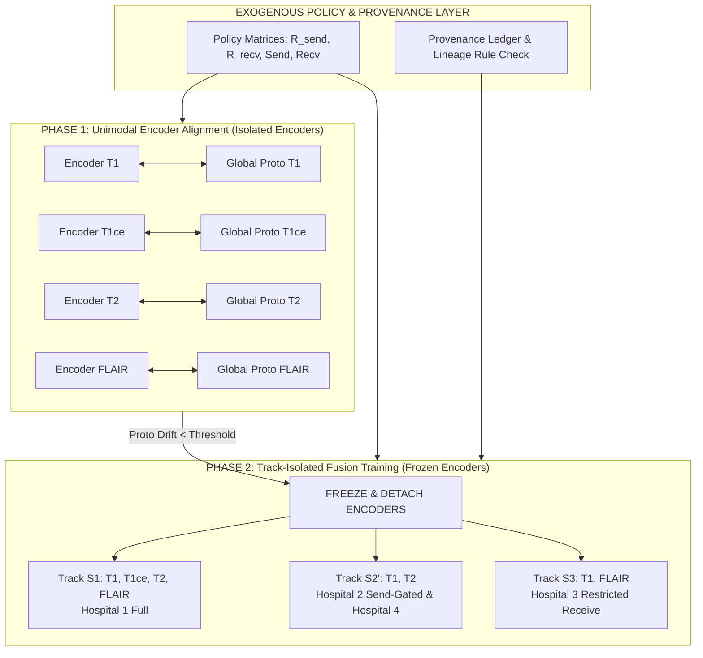

# CAMFS Unified Architecture (Method 2 + Patch) — Orientation Brief

## 1. One-Sentence Summary

CAMFS (Consent-Aware Multimodal Federated Segmentation) is a privacy-governed federated learning framework that guarantees institutional consent rules (ethics board restrictions, MoU contracts, hardware absence) are strictly enforced at the computation-graph level, preventing non-consented modality signals from contaminating a hospital's model while preserving high segmentation accuracy.

---

## 2. The Problem, in Plain English

In real-world healthcare networks, hospitals want to collaborate to train AI models (like segmenting brain tumors from MRI scans) without centralizing patient data. However, hospitals do not all have the same data or permissions:
- **Hardware Absence:** Hospital A has no PET or T1ce scanner, so its clinical workflow will never scan patients with those modalities.
- **Ethics & Legal Restrictions:** Hospital B has MRI scanners but lacks institutional ethics board clearance to export updates derived from specific sequences (e.g., T1ce).
- **Asymmetric Governance:** Hospital C wants to contribute its basic MRI scans to help the community, but strictly forbids receiving any external model updates that were influenced by modalities it doesn't own.

In existing federated learning, if a hospital joins a multi-modality training loop, gradients from all modalities mix together in shared neural network layers. As a result, a hospital that legally cannot use T1ce data ends up with a model whose internal weights were implicitly shaped by T1ce signals from other hospitals. This creates an un-auditable compliance violation.

---

## 3. Why Existing Approaches Fall Short

Existing multimodal federated learning frameworks treat missing modalities purely as a **performance optimization problem**:
1. **Imputation & Soft Gating (e.g., DisentAFL, FedMIR):** They try to reconstruct missing modalities or use learned soft attention weights to maximize segmentation accuracy. They treat missing data as an inconvenience to be filled in, completely ignoring legal consent.
2. **Dynamic / Learned Routing:** They decide what data to share based on model accuracy or communication bandwidth (e.g., Shapley values). This means a learned gate might decide to send a forbidden modality signal simply because it improves loss, violating institutional policy.
3. **Conflating Ownership with Sharing:** Prior methods assume that if a hospital owns a modality, it automatically shares it, and if it doesn't share it, it cannot use it locally. They lack the fine-grained policy control to say: *"I own T1ce, I will use it for my local patients, but I refuse to let my T1ce updates leave my building."*

---

## 4. The Core Idea: Two-Phase Training + Send-Gated Track Routing

CAMFS separates consent enforcement from performance optimization. Instead of soft learned penalties, CAMFS enforces consent **structurally** through two key innovations:

1. **Temporal & Computation Graph Isolation (Method 2 Two-Phase Training):**
   - **Phase 1 (Unimodal Alignment):** Encoders for each modality (T1, T1ce, T2, FLAIR) are trained completely in isolation using feature prototype alignment. No fusion layers exist in the network graph during Phase 1.
   - **The Freeze:** Once unimodal encoders stabilize, they are frozen and permanently detached (`detach()`).
   - **Phase 2 (Track-Isolated Fusion):** Fusion heads and decoders are trained for specific modality combinations (tracks). Because the encoders are frozen and detached, gradients from Phase 2 fusion can **never** flow backwards into the unimodal encoders.

2. **Send-Gated Track Re-keying & Provenance Ledger (The Patch):**
   - A hospital's contribution to shared fusion tracks is keyed by what it agrees to **send** ($\text{Send}(i)$), not what it **owns** ($O(i)$).
   - If Hospital 2 owns $\{\text{T1, T1ce, T2}\}$ but refuses to upload $\text{T1ce}$ updates, CAMFS re-keys Hospital 2 to contribute only to Track $S_{\text{T1,T2}}'$. Hospital 2 still uses $\text{T1ce}$ locally via a private, non-transmitted local head.
   - An exogenous, inspectable **Provenance Ledger** logs all model lineage to ensure no track is ever initialized from a seed that touched forbidden modalities.

---

## 5. Big-Picture System Architecture

---

## 6. Plain-English Glossary

- **Modality Universe ($\mathcal{M}$):** The set of all 4 MRI sequences used in brain tumor segmentation: T1, T1ce (contrast-enhanced), T2, and FLAIR.
- **Unimodal Encoder Bank:** Four separate neural network encoders, one dedicated to each modality. They never mix signals during feature extraction.
- **Prototype Bank:** A set of class-specific feature centroid vectors (for Background, Necrotic Core, Edema, Enhancing Tumor) used in Phase 1 to align modalities into a shared embedding space without fusion.
- **Subset-Fusion Track ($S$):** A specialized fusion head and decoder trained exclusively for a specific combination of modalities (e.g., Track $\{\text{T1, FLAIR}\}$). Parameters are strictly isolated between different tracks.
- **Send Policy ($\text{Send}(i)$):** The explicit list of modalities a hospital consents to transmit updates for to the federation.
- **Receive Policy ($\text{Recv}(i)$):** The explicit list of modalities a hospital permits to shape the models it receives back.
- **Send-Gated Re-keying:** Routing a hospital's uploaded fusion updates to a track matching its $\text{Send}(i)$ policy, rather than its local ownership $O(i)$.
- **Personalized Local Head:** A private, never-transmitted fusion head trained strictly inside a hospital's walls to combine all locally owned modalities (e.g., using $\text{T1ce}$ locally while withholding it from the server).
- **Lineage Rule:** A strict governance check ensuring that a new fusion track is initialized only from seed models whose training history contains zero non-consented modalities.
- **Provenance Ledger:** An auditable, immutable server-side log recording track instantiations, lineage checks, and client policy registrations.

---

## 7. Roadmap of Stepper Widgets

1. **Widget 1: Unimodal Encoder Alignment & Stabilization (Phase 1)**
   - Shows how local unimodal encoders extract features from available modalities and align them against global class prototypes using InfoNCE contrastive loss without any fusion graph.
2. **Widget 2: Freeze Transition & Graph Detach Gate**
   - Demonstrates the Phase Controller checking prototype drift, executing the 5-step freeze, setting `requires_grad=False`, and inserting `detach()` operators into the computation graph.
3. **Widget 3: Send-Gated Track Routing & Aggregation (Phase 2)**
   - Details how Hospital 2 ($O=\{\text{T1, T1ce, T2}\}, \text{Send}=\{\text{T1, T2}\}$) is re-keyed to Track $S_{\text{T1,T2}}'$ on upload while training a private local head for $\text{T1ce}$.
4. **Widget 4: Multi-Track Contribution & Tiered Cold-Start**
   - Illustrates Hospital 1 using masked forward passes ($R_{\text{contribute}}$) to support Hospital 3's minority track, and Hospital 4 onboarding via Tier 1b composable subset stitching.
5. **Widget 5: End-to-End Federation Lifecycle & Purity Probe Verification**
   - Displays the complete multi-round cycle across all 4 hospitals and runs the Purity Probe diagnostic to empirically prove zero cross-modal leakage.
